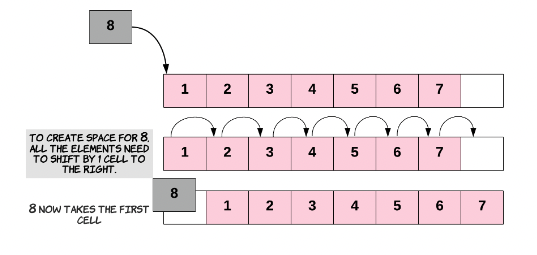

# List and Array Algorithms

## Insert a new DVD into the collection at a specific location.

### Inserting a new element at the end of the Array.

1. find index of last element of array
   1. you may keep track of it by implementing a `length` variable

2. assign the new element to one index past the current last element 


```python

array = []
length = 0

for i in array:
    while i = 0 and i < 3>:
        array.append(i+=1)
```

### Inserting a new element at the beginning of the Array.

1. shift all other elements in the array to the right by one index to create space for the new element 



### Inserting a new element at any given index inside the Array.

1. shift all the elements from the index you are inserting and owards one position to the right
2. once space is created you can proceed with the insertion


## Delete a DVD from the existing collection if it doesn't make sense to keep it in the inventory anymore.

## Search for a particular DVD in the collection. 

This is one of the most commonly executed operation on our collection, because our inventory management software would be used hundreds of times a day to look for a particular DVD asked for by the user.